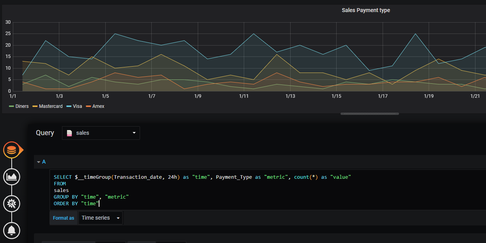

## CSV datasource for Grafana 6.x.x

#### Install
- Copy files from the `dist` folder to your [Grafana plugin directory](https://grafana.com/docs/grafana/latest/plugins/installation/#grafana-plugin-directory)
- Ensure that executable file has the execute flag
- Restart Grafana
- Check datasource list as http://you-grafana/datasources/new

##### Grafana 7.x.x
> The plugin is unsigned, hence you may face the error:
>
> `lvl=eror msg=“Failed to load plugin” logger=plugins error=“plugin “grafana-csv-plugin” is unsigned”`
>
> To get it to work you should make configuration as described in [documentation](https://grafana.com/docs/grafana/latest/installation/configuration/#allow-loading-unsigned-plugins)

#### Features
- Read local CSV file
- SQL queries (under the hood CSV will be converted into in-memory SQLite3 DB)
- Auto-detect column types by the first data row
- Reloading CSV file on changing
- Macros:
  * $__timeFilter(dateColumn)
  * $__timeGroup(dateColumn, interval)
  * $__unixEpochFrom()
  * $__unixEpochTo()

#### CSV format
- Each CSV file must have the first row with column names

#### Query
- [SQLite3](https://www.sqlite.org/index.html)
- Each DS has its own table, the name of the table coincides with the DS name (for example the DS name is `my_data`, hence in a query you should select from `my_data` table)

#### Macros

| Macros                             | Description                               |
|------------------------------------|-------------------------------------------|
| $__timeFilter(dateColumn)          | Will be replaced by a time range filter using the specified column name. For example, dateColumn BETWEEN ‘2017-04-21T05:01:17Z’ AND ‘2017-04-21T05:06:17Z’ |
| $__timeGroup(dateColumn, interval), Examples: `sec: $__timeGroup(dateColumn, 60); min: $__timeGroup(dateColumn, 60m); hour: $__timeGroup(dateColumn, 1h)` | Will be replaced by an expression usable in a GROUP BY clause. For example, datetime((strftime('%s', dateColumn) / 60) * 60, 'unixepoch') |
| $__unixEpochFrom()                 | Will be replaced by the start of the currently active time selection as Unix timestamp. For example, 1494410783 |
| $__unixEpochTo()                   | Will be replaced by the end of the currently active time selection as Unix timestamp. For example, 1494497183 |

#### Build graphs

Example:

- CSV File: data/SacramentocrimeJanuary2006.csv
- DS name `jan_2006`
- group by 1 hour
- filter by current time range

```sql
SELECT $__timeGroup(cdatetime, 1h) as "time", district as "metric", count(*) as "value"
FROM
    jan_2006
WHERE
    $__timeFilter(cdatetime)
GROUP BY "time", "metric"
ORDER BY "time"
```


Example:

- CSV File: data/SalesJan2009.csv
- DS name `sales`
- group by 24 hours

```sql
SELECT $__timeGroup(Transaction_date, 24h) as "time", Payment_Type as "metric", count(*) as "value"
FROM
sales
GROUP BY "time", "metric"
ORDER BY "time"
```



#### Simple table


#### Config
- Read local file


- Read remote file


#### Build
- npm run build

#### Docker (Grafana 6.7.4)
- `manage.sh build` (build docker image)
- `manage.sh up` (run container)
- `manage.sh down` (stop container)

After starting container go to the showcase dashboard:
http://your-host:3000/d/DTRcLsVGk/showcase-sales?orgId=1

#### Prev version
- [1.1.0](https://github.com/paveldanilin/grafana-csv-plugin/tree/1.1.0) which doesn't support SQL, but supports the filtering expressions.


###### Example data set: /data
###### Icon: https://freeicons.io/vector-file-types-icons/csv-icon-2272
