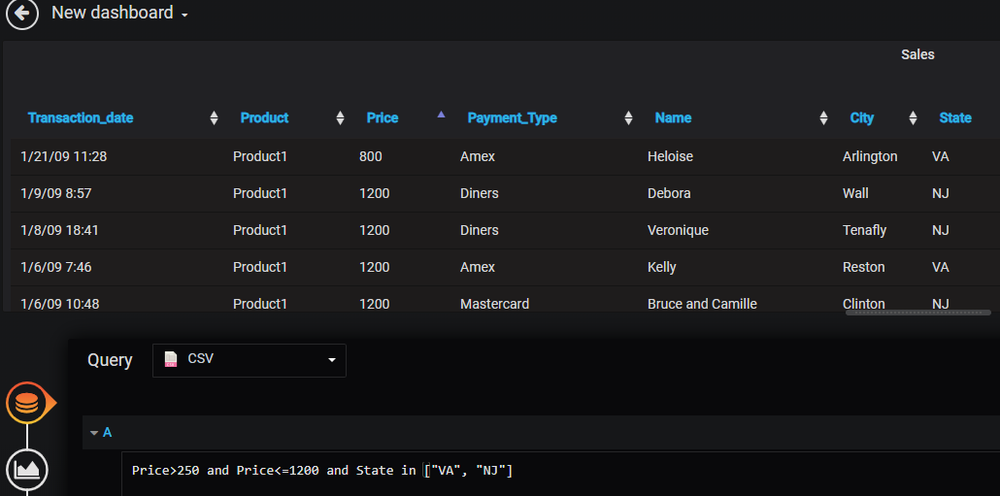
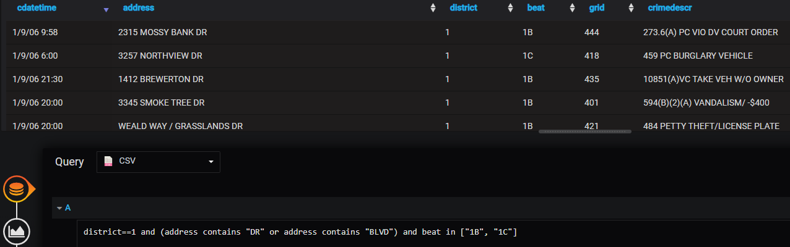

## Grafana CSV datasource plugin

Grafana datasource which allows:
- Read local CSV file
- Read remote CSV file by SFTP
- Filter data (thanks to a great [expr library](https://github.com/antonmedv/expr/blob/master/docs/Language-Definition.md))

## Config
- Local

- Remote

## Build
- npm run build

## Test
- npm test

## Install
- Copy `dist` to `/etc/grafana/data/plugins/grafana-csv-plugin/`

###### Icon: https://freeicons.io/vector-file-types-icons/csv-icon-2272
