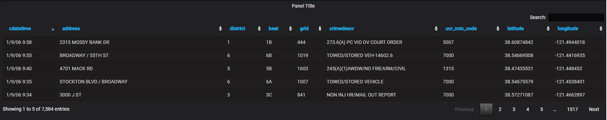
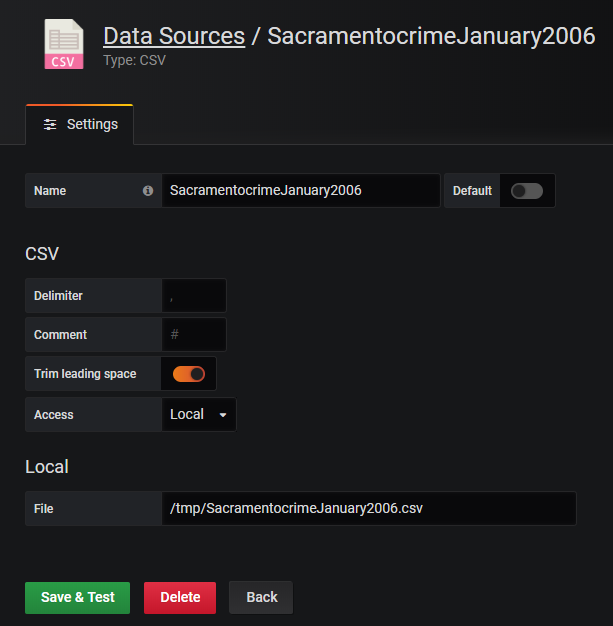
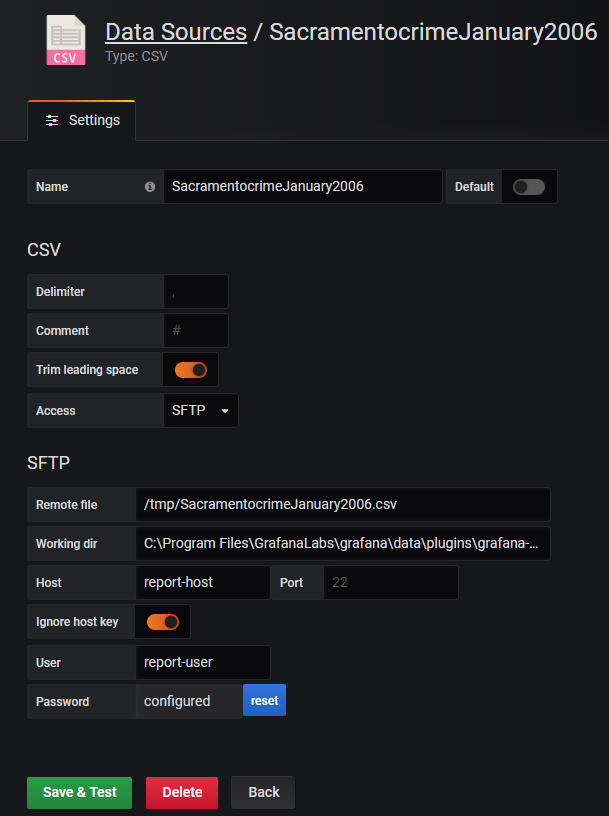

## Grafana CSV datasource plugin

Grafana datasource which allows:
- Read local CSV file
- Read remote CSV file by SFTP

## Config
- Local

- Remote

## Build
- npm run build

## Test
- go test ./tests -v

## Package
`grafana-csv-plugin_1.0.0.zip` includes binary for windows and linux

## Install
- Unpack `grafana-csv-plugin_1.0.0.zip` to `/etc/grafana/data/plugins/grafana-csv-plugin/`
- Restart Grafana

###### Icon: https://freeicons.io/vector-file-types-icons/csv-icon-2272
